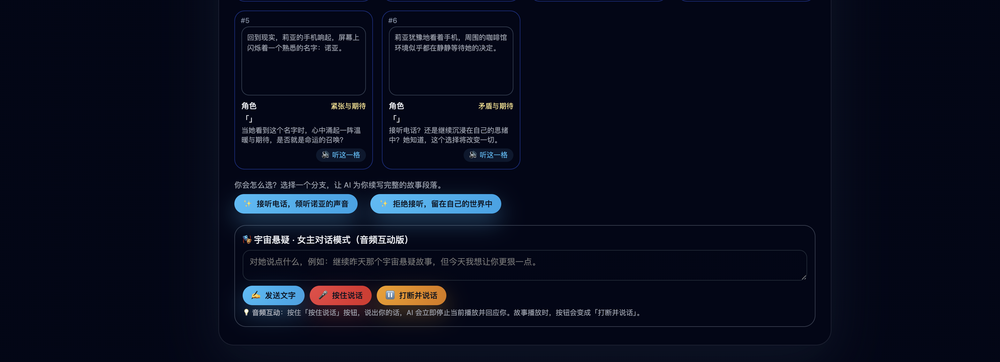
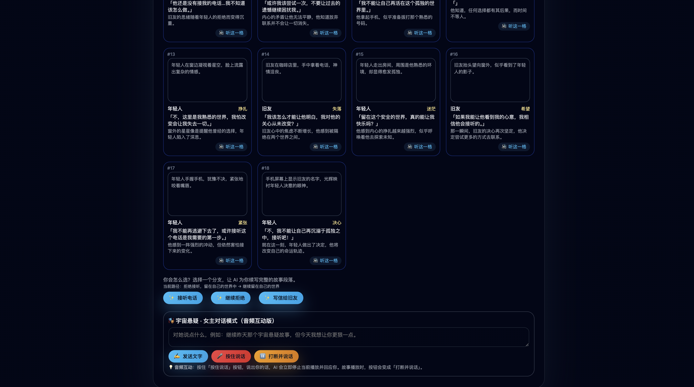
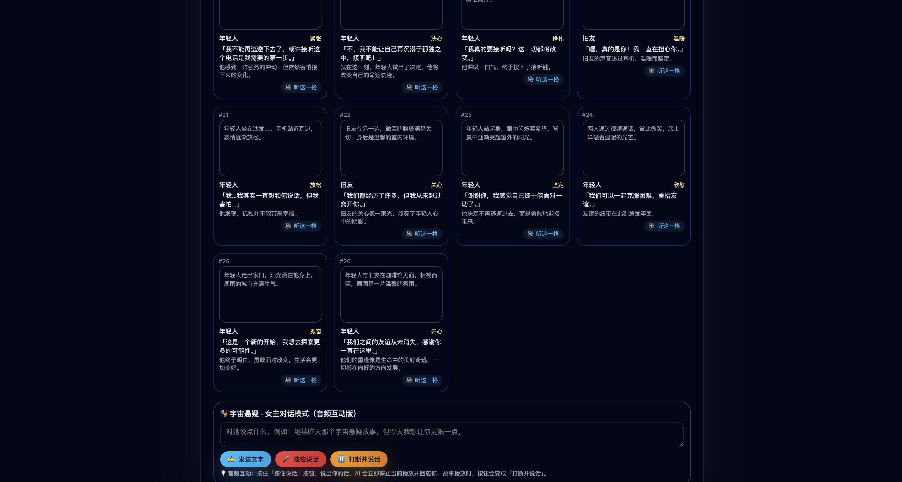

## AI 漫剧 Demo

一个使用 Python + FastAPI 搭建的 AI 漫剧小产品 Demo（骨架版），后续可以接入通用 / 多模态大模型与 TTS。

### 当前目标

- 提供默认4个场景，生成一集「漫剧分镜」，自动播放
- 提供一个简单前端页面：调用该接口，并以卡片形式展示分镜（图占位 + 文本字幕）。
- 用户可以随时打断，可以选择不同的分支，故事走向不同的结局

### 运行方式

1. 创建虚拟环境并安装依赖：

```bash
cd /Users/bcui/Downloads/vscode
python -m venv .venv
source .venv/bin/activate  # Windows 使用 .venv\\Scripts\\activate
pip install -r requirements.txt
```

2. 导入KEY并且启动后端：

```bash
export OPENROUTER_API_KEY="your KEY"
uvicorn app.main:app --reload
点击frontend.html,进入到web页面
```

3. 访问前端，体验简单的 AI 漫剧分镜生成。
- 页面首先展示的是4个默认的卡片场景
  <p align="center">
  
</p>

- 任意点击一个卡片故事，AI会自动生成短格故事，并自动播放
  <p align="center">
  
</p>

- 故事播放完毕，点击不同的分支剧情，故事走向不同的结局
  <p align="center">
  
</p>

- 继续点击分支故事
  <p align="center">
  
</p>

- 继续点击分钟故事
  <p align="center">
  
</p>

- 播放中可以随时打断，并且可以语音输入自己想要的场景，故事会迎来不同的结局
  <p align="center">
  
</p>
